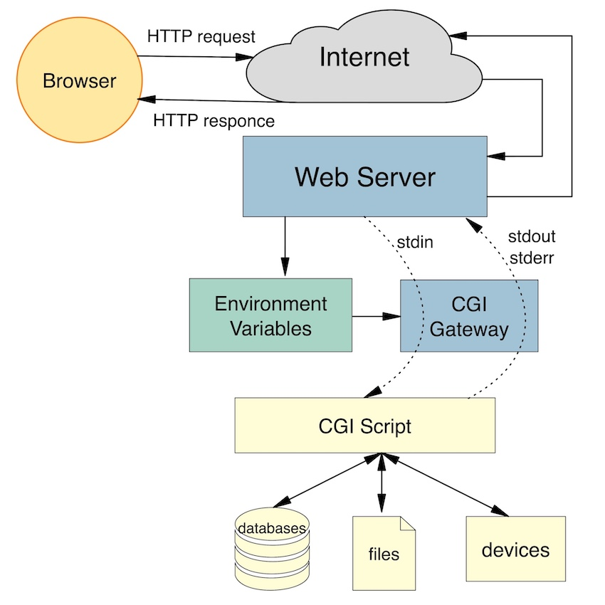

<h1 align="center">
	
 </h1>

 <div align="center">

[](https://github.com/nandajfa/webserv/blob/main/LICENSE)

 </div>

### 🗣️ About

> _This project is about writing your ow HTTP server._

####

-> HTTP is one of the most used protocols on the internet. Knowing its arcane will be useful, even if you won’t be working on a website.

---

### Index

- [HTTP Intro](#introduction)
- [HTTP Messages](#http-messages)
- [HTTO Methods](#http-methods)
- [Parts of a web server](#parts-of-a-web-server)
- [References 📌](#references)
- [Usage](#usage)
- [Skills 📄](#skills)
- [Author Info ✒️](#author)

## Introduction

The Hypertext Transfer Protocol (HTTP) is an application protocol for distributed, collaborative, hypermedia information systems.
The primary function of a web server is to store, process, and deliver web pages to clients. The communication between client and server takes place using the Hypertext Transfer Protocol (HTTP).

An HTTP web server is a software application that listens for and responds to HTTP requests from clients (such as web browsers). The main purpose of a web server is to host web content and make it available to users over the internet.

HTTP consists of requests and responses. When a client (such as a web browser) wants to retrieve a webpage from a server, it sends an HTTP request to the server. The server then processes the request and sends back an HTTP response.

## HTTP Messages

HTTP messages are how data is exchanged between a server and a client. There are two types of messages: requests sent by the client to trigger an action on the server, and responses, the answer from the server.

<details>
    <summary>HTTP Requests</summary>

- Start line

HTTP requests are messages sent by the client to initiate an action on the server. Their start-line contain three elements:

1. An HTTP method, a verb (like GET, PUT or POST) or a noun (like HEAD or OPTIONS), that describes the action to be performed.
2. The request target, usually a URL, or the absolute path of the protocol, port, and domain are usually characterized by the request context.
3. The HTTP version, which defines the structure of the remaining message, acting as an indicator of the expected version to use for the response.

- Request header

Example after a `GET` request:

```HTTP
GET /home.html HTTP/1.1
Host: developer.mozilla.org
User-Agent: Mozilla/5.0 (Macintosh; Intel Mac OS X 10.9; rv:50.0) Gecko/20100101 Firefox/50.0
Accept: text/html,application/xhtml+xml,application/xml;q=0.9,*/*;q=0.8
Accept-Language: en-US,en;q=0.5
Accept-Encoding: gzip, deflate, br
Referer: https://developer.mozilla.org/testpage.html
Connection: keep-alive
Upgrade-Insecure-Requests: 1
If-Modified-Since: Mon, 18 Jul 2016 02:36:04 GMT
If-None-Match: "c561c68d0ba92bbeb8b0fff2a9199f722e3a621a"
Cache-Control: max-age=0
```

- Body

Bodies can be broadly divided into two categories:

1. Single-resource bodies, consisting of one single file, defined by the two headers: Content-Type and Content-Length.
2. Multiple-resource bodies, consisting of a multipart body, each containing a different bit of information. This is typically associated with HTML Forms.

</details>

<details>
    <summary>HTTP Responses</summary>

- Status line

The start line of an HTTP response, called the status line, contains the following information:

1. The protocol version, usually HTTP/1.1.
2. A status code, indicating success or failure of the request. Common status codes are 200, 404, or 302
3. A status text. A brief, purely informational, textual description of the status code to help a human understand the HTTP message.

A typical status line looks like: HTTP/1.1 404 Not Found.

- Responde header

A response header is an HTTP header that can be used in an HTTP response and that doesn't relate to the content of the message. Response headers, like Age, Location or Server are used to give a more detailed context of the response.

Example after a `GET` request:

```HTTP
200 OK
Access-Control-Allow-Origin: *
Connection: Keep-Alive
Content-Encoding: gzip
Content-Type: text/html; charset=utf-8
Date: Mon, 18 Jul 2016 16:06:00 GMT
Etag: "c561c68d0ba92bbeb8b0f612a9199f722e3a621a"
Keep-Alive: timeout=5, max=997
Last-Modified: Mon, 18 Jul 2016 02:36:04 GMT
Server: Apache
Set-Cookie: mykey=myvalue; expires=Mon, 17-Jul-2017 16:06:00 GMT; Max-Age=31449600; Path=/; secure
Transfer-Encoding: chunked
Vary: Cookie, Accept-Encoding
X-Backend-Server: developer2.webapp.scl3.mozilla.com
X-Cache-Info: not cacheable; meta data too large
X-kuma-revision: 1085259
x-frame-options: DENY
```

- Body

Bodies can be broadly divided into three categories:

1. Single-resource bodies, consisting of a single file of known length, defined by the two headers: Content-Type and Content-Length.
2. Single-resource bodies, consisting of a single file of unknown length, encoded by chunks with Transfer-Encoding set to chunked.
3. Multiple-resource bodies, consisting of a multipart body, each containing a different section of information. These are relatively rare.
</details>

<div align="right">
  <b><a href="#index">↥ back to top</a></b>
</div>
</br>

## HTTP Methods

| Method   |                                                         Description                                                         | Possible body |
| -------- | :-------------------------------------------------------------------------------------------------------------------------: | ------------- |
| `GET`    |      The GET method requests a representation of the specified resource. Requests using GET should only retrieve data.      | NO            |
| `POST`   | The POST method submits an entity to the specified resource, often causing a change in state or side effects on the server. | YES           |
| `DELETE` |                                      The DELETE method deletes the specified resource.                                      | YES           |
| `PUT`    |            The PUT method replaces all current representations of the target resource with the request payload.             | YES           |
| `HEAD`   |               The HEAD method asks for a response identical to a GET request, but without the response body.                | NO            |

## Parts of a web server

A basic HTTP web server consists of several components that work together to receive and process HTTP requests from clients and send back responses. Below are the main parts of our webserver.

<details>
    <summary>Server Core</summary>

The networking part of a web server that handles TCP connections and performs tasks such as listening for incoming requests and sending back responses. It is responsible for the low-level networking tasks of the web server, such as creating and managing sockets, handling input and output streams, and managing the flow of data between the server and clients.

Before writing your webserver, I would recommend reading this awesome guide on building simple TCP client/server in C as it will help you get a good understanding of how TCP works in C/C++. also you would need to understand I/O multiplixing, this video will help you grasp the main idea of select().

The I/O Multiplexing process in our web server is summarized in the flowchart below. (CGI is not included in the flowchart but may be added in the future)

</details>

<details>
    <summary>Request Parser</summary>
    The parsing part of a web server refers to the process that is responsible for interpreting and extracting information from HTTP requests. In this web server, the parsing of requests is performed by the HttpRequest class. An HttpRequest object receives an incoming request, parses it, and extracts the relevant information such as the method, path, headers, and message body(if present). If any syntax error was found in the request during parsing, error flags are set and parsing stops. Request can be fed to the object through the method feed() either fully or partially, this is possible because the parser scans the request byte at a time and update the parsing state whenever needed. The same way of parsing is used by Nginx and Nodejs request parsers.

</details>

<details>
    <summary>Response Builder</summary>

The response builder is responsible for constructing and formatting the HTTP responses that are sent back to clients in response to their requests. In this web server, the Response class is responsible for building and storing the HTTP response, including the status line, headers, and message body. The response builder may also perform tasks such as setting the appropriate status code and reason phrase based on the result of the request, adding headers to the response to provide additional information about the content or the server, and formatting the message body according to the content type and encoding of the response. For example, if the server receives a request for a webpage from a client, the server will parse the request and pass it to a Response object which will fetch the contents of the webpage and construct the HTTP response with the HTML content in the message body and the appropriate headers, such as the Content-Type and Content-Length headers.

</details>

<details>
    <summary>Configuration File</summary>

Configuration file is a text file that contains various settings and directives that dictate how the web server should operate. These settings can include things like the port number that the web server should listen on, the location of the web server's root directory, and many other settings.

Here is an example fie that shows config file format and supported directives.

    ```
    server {
    	listen 8001;                        # listening port, mandatory parameter
    	host 127.0.0.1;                     # host or 127.0.0.1 by default
    	server_name test;                   # specify server_name, need to be added into /etc/hosts to work
    	error_page 404 /error/404.html;     # default error page
    	client_max_body_size 1024;          # max request body size in bytes
    	root docs/fusion_web/;              # root folder of site directory, full or relative path, mandatory parameter
    	index index.html;                   # default page when requesting a directory, index.html by default

    location /tours {
    	root docs/fusion_web;           # root folder of the location, if not specified, taken from the server.
    									# EX: - URI /tours           --> docs/fusion_web/tours
    									#     - URI /tours/page.html --> docs/fusion_web/tours/page.html
    	autoindex on;                   # turn on/off directory listing
    	allow_methods POST GET;         # allowed methods in location, GET only by default
    	index index.html;               # default page when requesting a directory, copies root index by default
    	return abc/index1.html;         # redirection
    	alias  docs/fusion_web;         # replaces location part of URI.
    									# EX: - URI /tours           --> docs/fusion_web
    									#     - URI /tours/page.html --> docs/fusion_web/page.html
    }

    location cgi-bin {
    	root ./;                                                 # cgi-bin location, mandatory parameter
    	cgi_path /usr/bin/python3 /bin/bash;                     # location of interpreters installed on the current system, mandatory parameter
    	cgi_ext .py .sh;                                         # extensions for executable files, mandatory parameter
    	}
    }
    ```

</details>

<details>
    <summary>CGI</summary>

CGI is a standard for running external programs from a web server. When a user requests a web page that should be handled by a CGI program, the web server executes the program and returns the output to the user's web browser. CGI programs are simply scripts that can be written in any programming language, such as Perl, Python, or bash, and are typically used to process data submitted by a user through a web browser, or to generate dynamic content on a web page.

<div align="center">



</div>

</details>

<div align="right">
  <b><a href="#index">↥ back to top</a></b>
</div>
</br>

## Usage

```bash
# Clone the project and acess the folder
git clone https://github.com/nandajfa/webserv.git && cd webserv

# Run make to compile the program
make

# Run the apllication with config file
./weberv <name>.conf

# Access the default website using URL
http://localhost/<name>/

# Clean the program
make fclean

```

## References

- [MDN - HTTP](https://developer.mozilla.org/en-US/docs/Web/HTTP)
- [CGI](https://www.tutorialspoint.com/cplusplus/cpp_web_programming.htm)
- [Simple server with C++](https://ncona.com/2019/04/building-a-simple-server-with-cpp/)
- [HTTP and CGI explained](https://www.garshol.priv.no/download/text/http-tut.html)
- [Beej's Guide](https://beej.us/guide/bgnet/html/)
- [Load Testing Web Servers with Siege](https://www.linode.com/docs/guides/load-testing-with-siege/)
- [Configuration file](http://nginx.org/en/docs/dirindex.html)
- [Front-end](https://www.youtube.com/watch?v=VKmPGmFY7H4&t=777s)
- [Sockets - Client - Server](https://www.youtube.com/watch?v=lc6U93P4Sxw)

## Skills

- Unix
- Rigor
- Network & system administration
- Object-oriented programming

## Author

<table >
  <tr>
    <td align="center"><a href="https://github.com/marcocslima"><br /><sub><b>Marco Lima</b></sub></a><br />
    <td align="center"><a href="https://github.com/Mitsu325"><br /><sub><b>Patrícia Mitsuko</b></sub></a><br />
        <td align="center"><a href="https://www.linkedin.com/in/jessica-fernanda-programadora"><br /><sub><b>Jessica Fernanda</b></sub></a><br />

  </tr>

<div align="right">
  <b><a href="#index">↥ back to top</a></b>
</div>
</br>
